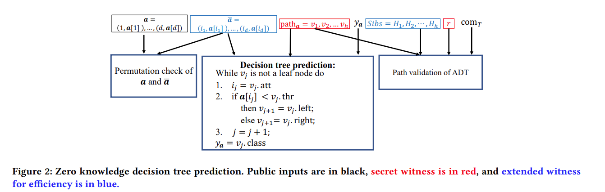

# Zero-knowledge proof
## Basic Concepts 
MSM: multiple scalar multiplications in an elliptic curve group then adding them together
example: $C=a\cdot g_0+b\cdot g_1+c\cdot g_2$
## Bulletproof
### My personal understandings about bulletproof
Bulletproof is an inner product proof.
Prover knows vector $a,b$, commits to them.
Verifier only has commitments to $a,b$.
First only consider vector length=2.
Pedersen commitment on elliptic curve to $a,b,a\cdot b$
$C$= $a_Lg_L+a_Rg_R+b_Lh_L+b_Rh_R+(a\cdot b)q$
Perdersen commitment for a single
Elliptic curve discrete log hard: $H=aG$, know $H,G$, hard to find $a$.
Prover sends verifier these two commitments:
$C_L=a_R\cdot g_L+b_L\cdot h_R+a_R b_L\cdot q$
$C_R=a_L\cdot g_R+b_R\cdot h_L+a_L b_R\cdot q$

Verifier send random challenge $x$

Prover update a,b:
$a'=a_L+x a_R$
$b'=b_L+x^{-1} b_R$

verifier computes new commitment:
$C'=xC_L+C+x^{-1}C_R$
$g'=g_L+x^{-1} g_R$
$h'=h_L+x h_R$

Transfers to proving the new statement which has $\frac{1}{2} n$ length, with assistance of prover sending L, R two elliptic curve points,
verifier perform $O(n)$ commitment folding in total.
$C'={\color{red}x a_R\cdot g_L}+{\color{green}xb_L\cdot h_R}+{\color{blue}x a_R b_L\cdot q}+{\color{red}a_Lg_L+a_Rg_R}+{\color{green}b_Lh_L+b_Rh_R}+{\color{blue}(a\cdot b)q}+\\
{\color{red}x^{-1}a_L\cdot g_R}+{\color{green}x^{-1}b_R\cdot h_L}+{\color{blue}x^{-1}a_Lb_R\cdot q}$

$a'g'+b'h'+a'b'q={\color{red}a_Lg_L+x^{-1}a_Lg_R+x a_R g_L+a_R g_R}+{\color{green}b_Lh_L+xb_Lh_R+x^{-1}b_Rh_L+b_Rh_R}+{\color{blue}a_Lb_Lq+xa_Rb_Lq+x^{-1}a_Lb_Rq+a_Rb_Rq}$

## Plonk
### PlonK: Permutations over Lagrange-bases for Oecumenical Noninteractive arguments of Knowledge

#### (d,D,t,l) Polynomial protocol: 
preprocess poly $g_1,..g_l$
Prover->I: $f_1,...f_t$
V->P : random coins
at the end: V ask  if certain identities hold between $f_1,..f_t,g_1…g_l$
I answers V, V accepts

#### S-ranged polynomial protocol 
verifier ask if identities hold on all points of S, not everywhere
core idea: prover can compute one more polynomial to enable this
$k$ identities asked: $F_1(x),...F_k(x)$
Prover compute $T=\frac{\sum_{i\in [k]} \alpha_i\cdot F_i}{\prod_{a\in S}(X-a)}$, here $\alpha_1...\alpha_k$ is random.
And verifier queries the identity:$\sum_{i\in [k]} \alpha_i \cdot F_i(x)=T\cdot \prod_{a\in S}(X-a) $

#### from poly protocol to practical protocols
input $g_i$ polynomial=> $com(g_i)$
Whenever Prover send $f_i$, actually send $com(f_i)$
when verifier asks about identity $F(x)=G(x,h_1(v_1(x)),...h_M(v_M(x)))$
$v_1...v_M$ may not be distinct, V send all of the distinct $v_1^*...v_t^*$ at random $x$.
Prover replies with the value of $h_1(v_1(x))...h_M(v_M(x))$, here verifier can't trust these values. here note that $h_i \in \{f_1...f_t,g_1...g_l\}$ 
They go through the polynomial commitment open to verify.

#### Proof size reduction
Linearization trick,
To be continued
### Plonkup : A simplified polynomial protocol for lookup table
prove statements that involve AES-128, SHA-256 problem: ZK unfriendly
involve bit decomposition, bitwise XOR, AND
lead to growing research into SNARK/STARK friendly hash functions, symmetric primitives based on native field functions.
lookup: for commonly used operations, precompute a lookup table of (input,output) combinations, prover argues the witness exist in the table.
Using randomness, reduce to the case of looking up single field element, instead of tupples, boils down to prove polynomials are same up to multiplicities

lookup table $\{t_i\}_{i\in [d]}$, values in the witness $\{f_i\}_{i\in [n]}$, lookup table size $d$, query lookup number $n$.
$\prod_{i\in [n]}(X-f_i)=\prod_{i\in [d]}(x-t_i)^{e_i}$, here $e_i \ge 0, i\in [d]$, this constraints that $f_i$ must be in $\{t_i\}$, there maybe duplicate $f_i$.
[BCG+] proposed to commit to a vector of length $d \text{log} n$. <font color=red>This way is clearly sub-optimal, current SOTA has already made the complexity independent with table size $d$, because even for 16-bit XOR, it requires a table size $2^{32}.$</font>

#### Main scheme:
look up table vector $t$, size $d$, lookup query vector $f$, number $n$,
$t\in F^d, f\in F^n, s\in F^{n+d}$
$H$ multiplicative subgroup of order $n+1$ in $F$, $H={1,g...g^{n}}$.
$f_i=f(g^i)$
When $f \subset t$, $f$ is sorted by $t$ is defined when values appear in the same order in $f$ as in $t$,
$F(\beta,\gamma)=(1+\beta)^n \prod_{i\in[n]} (\gamma+f_i)\prod_{i\in[d-1]}(\gamma(1+\beta)+t_i+\beta t_{i+1})$ 
$G(\beta,\gamma)=\prod_{i\in[n+d-1]}(\gamma(1+\beta)+s_i+\beta s_{i+1})$

Claim 3.1: F=G <=> $f\subset t$, $s$ is $(f,t)$ sorted by $t$.
If $f\subset t$, $s$ is $(f,t)$ sorted by $t$,
$f_i=s_i=s_{i+1}$ or $t_i=s_i, t_{i+1}=s_{i+1}$，therefore $F=G$
here we can assume that all elements of $t$ is different.

If $F=G$, <font color=red>(here is not F, G agree on one point and several points, but they are literally the same polynomial)</font>
we should view $F,G$ as polynomials of $\beta$ and $\gamma$.
Because they are the same, they should have same factors:
consider polynomial for $\gamma$(view $\beta$ as constant),for each $i$, there must be some $j$:
$\gamma+\left(t_i+\beta t_{i+1}\right) /(1+\beta)=\gamma+\left(s_j+\beta s_{j+1}\right) /(1+\beta)$,
this leads towards $s_j=t_i,s_{j+1}=t_{i+1}$
consider polynomial for $\beta$(view $\gamma$ as constant), for each $i$, there must be some $j$:
$\gamma+f_i=\gamma+\left(s_j+\beta s_{j+1}\right) /(1+\beta)$
this leads towards $f_i=s_j=s_{j+1}$

Make $d=n+1$. <font color=red>Then the computation of $F,G$ can be splitted into $n$ steps</font>, then everything is quite similar with Plonk protocol(verify the division $\frac{F(\beta,\gamma)}{G(\beta,\gamma)}$ step by step).
The complexity of the protocol $\mathfrak{o}(\mathscr{P})=5 n+4$, <font color=brown>probably here we can check with plonk compilation, how this polynomial protocol degree sum is related with prover complexity</font>. Plonk prover uses linear number of $G_1$ group exp, which is approximately $nlogn$ $F$ field multiplications.

Protocol is defined on all $x\in H$, this can be again compiled(combined) to one check, similar with tricks in plonk.

Question: <font color=brown>what is the complexity when $d$>>$n$, is it still only related with query number $n$? </font> <font color=green>Checked with Tianyang Tao: In Plonkup, they should pad the query when $d>>n$. So the prover complexity isn't independent with table size $d$. In future works like [cq], the prover proves that the new table(which unused elements are removed) is contained in the original full table.</font>


#### Generalize to multiple tables:
have $w$ witness polynomials, a table of values $t\in (F^w)^d$, check that for each $j\in [n]$, $\left(f_1\left(\mathbf{g}^j\right), \ldots, f_w\left(\mathbf{g}^j\right)\right) \in t$, essentially this is the case of checking a lookup with $w$ field items , we use <font color=red>randomization</font> to reduce to the scheme of checking one field item(main scheme).
The verifier will choose random $\alpha$ as challenge, prover compute $t:=\sum_{i \in[w]} \alpha^i t_i, f:=\sum_{i \in[w]} \alpha^i f_i$.
Assume that for some $j \in[n],\left(f_1\left(\mathbf{g}^j\right), \ldots, f_w\left(\mathbf{g}^j\right)\right) \notin t$. Then e.w.p $d \cdot w /|\mathbb{F}|$, $f\left(\mathbf{g}^j\right) \notin t$. Thus, after the selection of $\alpha$, we can run the protocol of the previous section on $f, t$.
Here essentially what happens is <font color=red>we randomly combine all elements of each (input,output) pair, for each pair we generate one field element, and the table also contains some single field elements</font>.
## KZG10
Trusted setup
random sample $\tau$ from $F_p$
consider $G, H$ as two different elliptic groups.
$SRS=\{G,\tau G, \tau^2 G,...,\tau^d G, H, \tau H\}$
delete $\tau$
how to commit to poly $f$
$C=comm(G,f)=f(\tau)\cdot G=f_0 G+ f_1 \tau G+f_2 \tau^2 G...$
open: at $u$, result $v$
evaluation proof: quotient polynomial $q(x)$
compute $q(x), q(x)\cdot(x-u)=f(x)-v$
compute $\pi=comm(G,q)$

check that $q(x)\cdot(x-u)=f(x)-v$ 
check by pairing: $e(\pi,comm(H,x-u))=e(comm(G,f(x)-v),comm(H,1))$
from the homorphic properties of KZG commiment:
$comm(H,x-u)=comm(H,x)-comm(H,u)=\tau H-u\cdot H$
$comm(G,f(x)-v)=comm(G,f(x))-comm(G,v)=C-v\cdot G$
$comm(H,1)=H$


## NOVA
### IVC Proof
#### Relaxed R1CS
The committed relaxed $R 1 C S$ structure consists of sparse matrices $A, B, C \in \mathbb{F}^{m \times m}$ with at most $n=\Omega(m)$ non-zero entries in each matrix. A committed relaxed $R 1 C S$ instance is a tuple ${\color{blue}(\bar{E}, u, \bar{W}, \mathrm{x})}$, where $\bar{E}$ and $\bar{W}$ are commitments, $u \in \mathbb{F}$, and $\mathrm{x} \in \mathbb{F}^{\ell}$ are public inputs and outputs. 

An instance $(\bar{E}, u, \bar{W}, \mathrm{x})$ is <font color=red>satisfied by a witness</font> $\left(E, r_E, W, r_W\right) \in\left(\mathbb{F}^m, \mathbb{F}, \mathbb{F}^{m-\ell-1}, \mathbb{F}\right)$ if $\bar{E}=$ $\operatorname{Com}\left(\mathrm{pp}_E, E, r_E\right), \bar{W}=\operatorname{Com}\left(\mathrm{pp}_W, W, r_W\right)$, and ${\color{blue}(A \cdot Z) \circ(B \cdot Z)=u \cdot(C \cdot Z)+E}$, where $Z=(W, \mathrm{x}, u)$.

The verifier $\mathcal{V}$ takes two committed relaxed R1CS instances $\left(\bar{E}_1, u_1, \bar{W}_1, \mathrm{x}_1\right)$ and $\left(\bar{E}_2, u_2, \bar{W}_2, \mathrm{x}_2\right)$. The prover $\mathcal{P}$, in addition to the two instances, takes witnesses to both instances, $\left(E_1, r_{E_1}, W_1, r_{W_1}\right)$ and $\left(E_2, r_{E_2}, W_2, r_{W_2}\right)$. Let $Z_1=\left(W_1, \mathrm{x}_1, u_1\right)$ and $Z_2=\left(W_2, \mathrm{x}_2, u_2\right)$. The prover and the verifier proceed as follows.
1. $\mathcal{P}$ : Send $\bar{T}:=\operatorname{Com}\left(\mathrm{pp}_E, T, r_T\right)$, where $r_T \leftarrow_R \mathbb{F}$ and with cross term
$$
T=A Z_1 \circ B Z_2+A Z_2 \circ B Z_1-u_1 \cdot C Z_2-u_2 \cdot C Z_1 \text {. }
$$
2. $\mathcal{V}$ : Sample and send challenge $r \leftarrow_R \mathbb{F}$.
3. $\mathcal{V}, \mathcal{P}$ : Output the folded instance $(\bar{E}, u, \bar{W}, \mathrm{x})$ where
$$
\begin{aligned}
& \bar{E} \leftarrow \bar{E}_1+r \cdot \bar{T}+r^2 \cdot \bar{E}_2 \\
& u \leftarrow u_1+r \cdot u_2 \\
& \bar{W} \leftarrow \bar{W}_1+r \cdot \bar{W}_2 \\
& \mathrm{x} \leftarrow \mathrm{x}_1+r \cdot \mathrm{x}_2
\end{aligned}
$$
4. $\mathcal{P}$ : Output the folded witness $\left(E, r_E, W, r_W\right)$, where
$$
\begin{aligned}
& E \leftarrow E_1+r \cdot T+r^2 \cdot E_2 \\
& r_E \leftarrow r_{E_1}+r \cdot r_T+r^2 \cdot r_{E_2} \\
& W \leftarrow W_1+r \cdot W_2 \\
& r_W \leftarrow r_{W_1}+r \cdot r_{W_2}
\end{aligned}
$$

<font color=red>The prover outputs folded instance+witness, the verifier only outputs witness.</font>

#### Non-interactive scheme with Fiat-Shamir Transform
$\mathcal{P}\left(\mathrm{pk},\left(u_1, w_1\right),\left(u_2, w_2\right)\right):$ runs $\mathrm{P}((\mathrm{pk} . \mathrm{pp}, \mathrm{pk} .(A, B, C))$ to retrieve its first message $\bar{T}$, and sends $\bar{T}$ to $\mathcal{V}$; computes $r \leftarrow \rho\left(\mathrm{vk}, u_1, u_2, \bar{T}\right)$, forwards this to $\mathrm{P}$, and outputs the resulting output.
$\mathcal{V}\left(\mathrm{vk}, u_1, u_2, \bar{T}\right)$ : runs $\mathrm{V}$ with $\bar{T}$ as the message from the prover and with randomness $r \leftarrow \rho\left(\mathrm{vk}, u_1, u_2, \bar{T}\right)$, and outputs the resulting output.


#### introducing $F'$
$F'$ is augmented version of $F$.
$F'$ takes input $u_i,U_i$, needs to fold them into $U_{i+1}$. $u_{i+1}$ attests to the correct execution  $i+1$ invocation of $F'$. $U_{i+1}$ attests to the correct execution of $1...i$ invocation of $F'$.

Design choice: Why $F'$ output hash: because $F'$ mush output $U_{i+1}$ for the next invocation to fold, it should be contained in $u_{i+1}.x$ as public IO. But later in the next invocation, $F'$ must fold  $u_{i+1}.x$ into $U_{i+1}.x$, it is impossible to place $U_{i+1}$ into $U_{i+1}.x$. 

#### $F'$ construction:
$F^{\prime}\left(\mathrm{vk}, \mathrm{U}_i, \mathrm{u}_i,\left(i, z_0, z_i\right), \omega_i, \bar{T}\right) \rightarrow \mathrm{x}:$
If $i$ is 0 , output hash $\left(\mathrm{vk}, 1, z_0, F\left(z_0, \omega_i\right), \mathrm{u}_{\perp}\right)$;
otherwise,
(1) check that $\mathrm{u}_i \cdot \mathrm{x}=\operatorname{hash}\left(\mathrm{vk}, i, z_0, z_i, \mathrm{U}_i\right)$, where $\mathrm{u}_i . \mathrm{x}$ is the public IO of $\mathrm{u}_i$,
(2) check that $\left(\mathrm{u}_i \cdot \bar{E}, \mathrm{u}_i \cdot u\right)=\left(\mathrm{u}_{\perp} \cdot \bar{E}, 1\right)$,
(3) compute $\mathrm{U}_{i+1} \leftarrow \mathrm{NIFS} . \mathrm{V}(\mathrm{vk}, \mathrm{U}, \mathrm{u}, \bar{T})$, and
(4) output hash(vk, $\left.i+1, z_0, F\left(z_i, \omega_i\right), \mathrm{U}_{i+1}\right)$.

We can represent $F'$ as an Relaxed R1CS scheme. 
$\left(\mathrm{u}_{i+1}, \mathrm{w}_{i+1}\right) \leftarrow \operatorname{trace}\left(F^{\prime},\left(\mathrm{vk}, \mathrm{U}_i, \mathrm{u}_i,\left(i, z_0, z_i\right), \omega_i, \bar{T}\right)\right)$
Here $\mathrm{u}_{i+1}$ is instance, $\mathrm{w}_{i+1}$ is witness.
$u_{i+1},w_{i+1}$ is a satisfying instance-witness pair for invocation of $F'$.

#### IVC scheme
$\underline{\mathcal{P}\left(\mathrm{pk},\left(i, z_0, z_i\right), \omega_i, \Pi_i\right) \rightarrow \Pi_{i+1}}:$
Parse $\Pi_i$ as $\left(\left(\mathrm{U}_i, \mathrm{~W}_i\right),\left(\mathrm{u}_i, \mathrm{w}_i\right)\right)$ and then
(1) if $i$ is 0 , compute $\left(\mathrm{U}_{i+1}, \mathrm{~W}_{i+1}, \bar{T}\right) \leftarrow\left(\mathrm{u}_{\perp}, \mathrm{w}_{\perp}, \mathrm{u}_{\perp} . \bar{E}\right)$; otherwise, compute $\left(\mathrm{U}_{i+1}, \mathrm{~W}_{i+1}, \bar{T}\right) \leftarrow \operatorname{NIFS} . \mathrm{P}\left(\mathrm{pk},\left(\mathrm{U}_i, \mathrm{~W}_i\right),\left(\mathrm{u}_i, \mathrm{w}_i\right)\right)$,
(2) compute $\left(\mathrm{u}_{i+1}, \mathrm{w}_{i+1}\right) \leftarrow \operatorname{trace}\left(F^{\prime},\left(\mathrm{vk}, \mathrm{U}_i, \mathrm{u}_i,\left(i, z_0, z_i\right), \omega_i, \bar{T}\right)\right)$, and
(3) output $\Pi_{i+1} \leftarrow\left(\left(\mathrm{U}_{i+1}, \mathrm{~W}_{i+1}\right),\left(\mathrm{u}_{i+1}, \mathrm{w}_{i+1}\right)\right)$.
$\underline{\mathcal{V}\left(\mathrm{vk},\left(i, z_0, z_i\right), \Pi_i\right) \rightarrow\{0,1\}:}$
If $i$ is 0 , check that $z_i=z_0$; otherwise,
(1) parse $\Pi_i$ as $\left(\left(\mathrm{U}_i, \mathrm{~W}_i\right),\left(\mathrm{u}_i, \mathrm{w}_i\right)\right)$,
(2) check that $\mathrm{u}_i . \mathrm{x}=\operatorname{hash}\left(\mathrm{vk}, i, z_0, z_i, \mathrm{U}_i\right)$,
(3) check that $\left(\mathrm{u}_i \cdot \bar{E}, \mathrm{u} . u\right)=\left(\mathrm{u}_{\perp} \cdot \bar{E}, 1\right)$, and
(4) check that $W_i$ and $w_i$ are satisfying witnesses to $U_i$ and $u_i$ respectively.

Here the prover first computes the folding result $U_{i+1},W_{i+1}$, they also compute $u_{i+1},w_{i+1}$ to attest the execution of this folding. so the final proof contains $U_{i+1},W_{i+1},u_{i+1},w_{i+1}$.

#### Efficiency Analysis
Lemma 4 (Efficiency). When instantiated with the Pedersen commitment scheme (Construction 6), we have that $\left|F^{\prime}\right|=|F|+o(2 \cdot \mathrm{G}+2 \cdot \mathrm{H}+\mathrm{R})$, where $|F|$ denotes the number of R1CS constraints to encode a function $F, \mathrm{G}$ is the number of constraints required to encode a group scalar multiplication, $\mathrm{H}$ is the number of constraints required to encode hash, and $\mathrm{R}$ is the number of constraints to encode the $R O \rho$.

Proof. On input instances U and u, NIFS.V computes $\bar{E} \leftarrow U . \bar{E}+r \cdot \bar{T}+r^2 \cdot \mathrm{u} \cdot \bar{E}$ and $\bar{W} \leftarrow U . \bar{W}+r \cdot \mathrm{u} \cdot \bar{W}$. However, by construction, u. $\bar{E}=\mathrm{u}_{\perp} \cdot \bar{E}=\overline{0}$. So, NIFS.V computes two group scalar multiplications, as it does not need to compute $r^2 \cdot \mathrm{u} . \bar{E}$. NIFS.V additionally invokes the $\mathrm{RO}$ once to obtain a random scalar. Finally, $F^{\prime}$ makes two additional calls to hash (details are in the description of $F^{\prime}$ ).

<font color=red>Here analyzes the number of contraints used in encoding F'. The conclusion is that other than F, the extra constraint number is not big.</font>

#### zkSNARK of IVC Proof
$\mathcal{P}\left(\mathrm{pk},\left(i, z_0, z_i\right), \Pi\right) \rightarrow \pi:$
If $i$ is 0 , output $\perp$;
otherwise,
(1) parse $\Pi$ as $((\mathrm{U}, \mathrm{W}),(\mathrm{u}, \mathrm{w}))$
(2) compute $\left(\mathrm{U}^{\prime}, \mathrm{W}^{\prime}, \bar{T}\right) \leftarrow$ NIFS.P $\left(\mathrm{pk}_{\text {NIFS }},(\mathrm{U}, \mathrm{W}),(\mathrm{u}, \mathrm{w})\right)$
(3) compute $\pi_{\mathrm{U}^{\prime}} \leftarrow$ zkSNARK.P( $\left.\mathrm{pk}_{\mathrm{zkSNARK}}, \mathrm{U}^{\prime}, \mathrm{W}^{\prime}\right)$
(4) output (U, u, $\left.\bar{T}, \pi_{\mathrm{U}^{\prime}}\right)$.
$\underline{\mathcal{V}\left(\mathrm{vk},\left(i, z_0, z_i\right), \pi\right) \rightarrow\{0,1\}:}$
If $i$ is 0 , check that $z_0=z_i$;
otherwise,
(1) parse $\pi$ as (U, u, $\left.\bar{T}, \pi_{\mathrm{U}^{\prime}}\right)$,
(2) check that u.x $=$ hash $\left(\operatorname{vk}_{\text {NIFS }}, i, z_0, z_i, \mathrm{U}\right)$,
(3) check that (u. $\bar{E}$, u.u $)=\left(\mathrm{u}_{\perp} \cdot \bar{E}, 1\right)$,
(4) compute $\mathrm{U}^{\prime} \leftarrow$ NIFS.V $\left(\mathrm{vk}_{\mathrm{NIFS}}, \mathrm{U}, \mathrm{u}, \bar{T}\right)$, and
(5) check that zkSNARK.V $\left(v_{z k S N A R K}, U^{\prime}, \pi_{U^{\prime}}\right)=1$.

Here $\pi_{U'}$ proves that prover knows $W'$ as a valid witness of $U'$, or that $\operatorname{IVC} . V\left(\mathrm{vk}, i, z_0, z_i, \Pi_i\right)=1$(because $U'$ is obtained by folding $U$ and $V$).


### A zkSNARK for Committed Relaxed R1CS
#### Idealized Relaxed R1CS 
Consider a finite field $\mathbb{F}$. Let the public parameters consist of size bounds $m, n, \ell \in \mathbb{N}$ where $m>\ell$. The idealized relaxed R1CS structure consists of sparse matrices $A, B, C \in \mathbb{F}^{m \times m}$ with at most $n=\Omega(m)$ non-zero entries in each matrix. A idealized relaxed R1CS instance consists of an error vector $E \in \mathbb{F}^m$, a scalar $u \in \mathbb{F}$, witness vector $W \in \mathbb{F}^m$, and public inputs and outputs $\mathrm{x} \in \mathbb{F}^{\ell}$. An instance $(E, u, W, \mathrm{x})$ is satisfying if $(A \cdot Z) \circ(B \cdot Z)=u \cdot(C \cdot Z)+E$, where $Z=(W, \mathrm{x}, u)$.


<font color=red>Here the major difference I think is that no commitments, all raw matrixes.</font>


Let $s=\log m$. We interpret the matrices $A, B, C$ as functions with signature $\{0,1\}^{\log m} \times\{0,1\}^{\log m} \rightarrow \mathbb{F}$ in a natural manner. In particular, an input in $\{0,1\}^{\log m} \times\{0,1\}^{\log m}$ is interpreted as the binary representation of an index $(i, j) \in[m] \times[m]$, where $[m]:=\{1, \ldots, m\}$ and the function outputs $(i, j)$ th entry of the matrix.

MLE of Z: $\widetilde{Z}\left(X_1, \ldots, X_s\right)=\left(1-X_1\right) \cdot \widetilde{W}\left(X_2, \ldots, X_s\right)+X_1 \cdot \widetilde{(\mathrm{x}, u)}\left(X_2, \ldots, X_s\right)$

Check the equality holds:
$$
0 \stackrel{?}{=} \sum_{x \in\{0,1\}^s} \tilde{\mathrm{eq}}(\tau, x) \cdot F(x),
$$
where
$$
\begin{aligned}
F(x)= & \left(\sum_{y \in\{0,1\}^s} \widetilde{A}(x, y) \cdot \widetilde{Z}(y)\right) \cdot\left(\sum_{y \in\{0,1\}^s} \widetilde{B}(x, y) \cdot \widetilde{Z}(y)\right)- \\
& \left(u \cdot \sum_{y \in\{0,1\}^s} \widetilde{C}(x, y) \cdot \widetilde{Z}(y)+\widetilde{E}(x)\right),
\end{aligned}
$$


If $\varphi$ is satisfiable, then Equation (2) holds with probability 1 over the choice of $\tau$, and if not, then Equation (2) holds with probability at most $O(\log m /|\mathbb{F}|)$ over the random choice of $\tau$.

Some reasoning here: if for all x , F(x)=0, which means $\varphi$ is satisfiable, the equality certainly holds. If not satisfied, then with high probability, this equality doesn't hold. 
Therefore, we can attest the satisfiability by random $\tau$.

To compute the right-hand side in Equation (2), the prover and the verifier apply the sum-check protocol to the following polynomial: ${\color{red}g(x):=\widetilde{\mathrm{eq}}(\tau, x) \cdot F(x)}$ 

For verifier, this reduces to evaluating $g$ at a random input $r_x$. 

Note that the verifier can locally evaluate $\widetilde{\text { eq }}\left(\tau, r_x\right)$ in $O(\log m)$ field operations.

 With $\tilde{\text { eq }}\left(\tau, r_x\right)$ in hand, $g\left(r_x\right)$ can be computed in $O(1)$ time given the four quantities: $\sum_{y \in\{0,1\}^s} \widetilde{A}\left(r_x, y\right) \cdot \widetilde{Z}(y)$, $\sum_{y \in\{0,1\}^s} \widetilde{B}\left(r_x, y\right) \cdot \widetilde{Z}(y), \sum_{y \in\{0,1\}^s} \widetilde{C}\left(r_x, y\right) \cdot \widetilde{Z}(y)$, and $\widetilde{E}\left(r_x\right)$.

 The first three can be checked by applying sum-check protocol in parallel. This suffices for the verifier to verify at $\widetilde{A}\left(r_x, r_y\right), \widetilde{B}\left(r_x, r_y\right), \widetilde{C}\left(r_x, r_y\right), \text { and } \widetilde{Z}\left(r_y\right)$ These are solvable by $\color{red}\text{oracle acess to} (\widetilde{A}, \widetilde{B}, \widetilde{C}).$


 In summary, we have the following polynomial IOP.
1. $\mathcal{V} \rightarrow \mathcal{P}: \tau \in_R \mathbb{F}^s$
2. $\mathcal{V} \leftrightarrow \mathcal{P}$ : run the sum-check protocol to reduce the check in Equation (2) to checking if the following hold, where $r_x, r_y$ are vectors in $\mathbb{F}^s$ chosen at random by the verifier over the course of the sum-check protocol:
- $\widetilde{A}\left(r_x, r_y\right) \stackrel{?}{=} v_A, \widetilde{B}\left(r_x, r_y\right) \stackrel{?}{=} v_B$, and $\widetilde{C}\left(r_x, r_y\right) \stackrel{?}{=} v_C$;
- $\widetilde{E}\left(r_x\right) \stackrel{?}{=} v_E$; and
$\widetilde{Z}\left(r_y\right) \stackrel{?}{=} v_Z$.
3. $\mathcal{V}$ :
- check if $\widetilde{A}\left(r_x, r_y\right) \stackrel{?}{=} v_A, \widetilde{B}\left(r_x, r_y\right) \stackrel{?}{=} v_B$, and $\widetilde{C}\left(r_x, r_y\right) \stackrel{?}{=} v_C$, with a query to $\widetilde{A}, \widetilde{B}, \widetilde{C}$ at $\left(r_x, r_y\right)$;
- check if $\widetilde{E}\left(r_x\right) \stackrel{?}{=} v_E$ with an oracle query to $\widetilde{E}$; and
- check if $\widetilde{Z}\left(r_y\right) \stackrel{?}{=} v_Z$ by checking if: $v_Z=\left(1-r_y[1]\right) \cdot v_W+r_y[1]$. $\widetilde{(\mathrm{x}, u)}\left(r_y[2]\right)$, where $r_y[2.. ]$ refers to a slice of $r_y$ without the first element of $r_y$, and $v_W \leftarrow \widetilde{W}\left(r_y[2]\right)$ via an oracle query (see Equation (1)).

#### Compile Poly IOP to zkSNARK
compilation is based on PCS:
Interpreting commitments to vectors as polynomial commitments. 

It is well known that commitments to $m$-sized vectors over $\mathbb{F}$ are commitments to $\log m$ variate multilinear polynomials represented with evaluations over $\{0,1\}^m$. Furthermore, there is a polynomial commitment scheme for $\log m$-variate multilinear polynomials if there exists an argument protocol to prove an inner product computation between a committed vector and an $m$-sized public vector $\left(\left(r_1, 1-r_1\right) \otimes \ldots \otimes\left(r_{\log m}, 1-r_{\log m}\right)\right)$, where $r \in \mathbb{F}^{\log m}$ is an evaluation point. 

There are two candidate constructions in the literature. Note that the primary difference between two schemes is <font color=red> verifier's time</font>.
1. $P C_{B P}$. If the commitment scheme is Pedersen, Bulletproofs provides a suitable inner product argument protocol. Bulletproof PCS assuming DLOG For a $\log m$-variate multilinear polynomial, committing takes $O_\lambda(m)$ time to produce an $O_\lambda(1)$-sized commitment; the prover incurs $O_\lambda(m)$ costs to produce an evaluation proof of size $O_\lambda(\log m)$ that can be verified in $O_\lambda(m)$. 

2. $\mathrm{PC}_{\text {Dory }}$. If vectors over $\mathbb{F}$ are committed with a two-tiered "matrix" commitment (see for example, $[19,34]$ ), which provides $O_\lambda(1)$-sized commitments to $m$-sized vectors under the SXDH assumption. Dory [34] provides the necessary inner product argument. The polynomial commitment assuming the hardness of SXDH. For a $\log m$-variate multilinear polynomial, committing takes $O_\lambda(m)$ time to produce an $O_\lambda(1)$-sized commitment; the prover incurs $O_\lambda(m)$ costs to produce an evaluation proof of size $O_\lambda(\log m)$ that can be verified in $O_\lambda(\log m)$.


## Groth16
### Vitalik Notes: QAP
For a function:

```python
def qeval(x):
    y = x**3
    return x + y + 5
```

#### Flattening
```python
sym_1 = x * x
y = sym_1 * x
sym_2 = y + x
~out = sym_2 + 5
```

#### Gates to R1CS
solution to R1CS is vector $s$. 
R1CS is a sequence of 3 vectors $(a,b,c)$, following the equation $(s\cdot a)\cdot (s\cdot b)-(s\cdot c)=0$.
First, we'll provide the variable mapping that we'll use:
```python
'~one', 'x', '~out', 'sym_1', 'y', 'sym_2'
s=[1,3,35,9,27,30]
```

Now, we'll give the (a,b,c) triple for the first gate:
```python
a = [0, 1, 0, 0, 0, 0]
b = [0, 1, 0, 0, 0, 0]
c = [0, 0, 0, 1, 0, 0]
```
This encodes that 
```python
sym_1 = x * x
```


The complete R1CS put together is:
```python
A
[0, 1, 0, 0, 0, 0]
[0, 0, 0, 1, 0, 0]
[0, 1, 0, 0, 1, 0]
[5, 0, 0, 0, 0, 1]

B
[0, 1, 0, 0, 0, 0]
[0, 1, 0, 0, 0, 0]
[1, 0, 0, 0, 0, 0]
[1, 0, 0, 0, 0, 0]

C
[0, 0, 0, 1, 0, 0]
[0, 0, 0, 0, 1, 0]
[0, 0, 0, 0, 0, 1]
[0, 0, 1, 0, 0, 0]
```
#### R1CS to QAP
Now we have 4 groups of 3 vectors of length 6
we want to go to 6 groups of 3 degree-3 polynomial.
evaluate at each $x$ gets one of the constraints,
evaluate at 1 gets first set of constraints
```
A polynomials
[-5.0, 9.166, -5.0, 0.833]
[8.0, -11.333, 5.0, -0.666]
[0.0, 0.0, 0.0, 0.0]
[-6.0, 9.5, -4.0, 0.5]
[4.0, -7.0, 3.5, -0.5]
[-1.0, 1.833, -1.0, 0.166]

B polynomials
[3.0, -5.166, 2.5, -0.333]
[-2.0, 5.166, -2.5, 0.333]
[0.0, 0.0, 0.0, 0.0]
[0.0, 0.0, 0.0, 0.0]
[0.0, 0.0, 0.0, 0.0]
[0.0, 0.0, 0.0, 0.0]

C polynomials
[0.0, 0.0, 0.0, 0.0]
[0.0, 0.0, 0.0, 0.0]
[-1.0, 1.833, -1.0, 0.166]
[4.0, -4.333, 1.5, -0.166]
[-6.0, 9.5, -4.0, 0.5]
[4.0, -7.0, 3.5, -0.5]
```
for the first polynomial,
$f(1)=0, f(2)=0, f(3)=0, f(4)=5$, encodes the first column(first variable) of $A$

evaluate all at $x=1$
```
A results at x=1
0
1
0
0
0
0

B results at x=1
0
1
0
0
0
0

C results at x=1
0
0
0
1
0
0
```

The first constraint vector for $A$ is $A_1(1),A_2(1)...A_6(1)$

The x-th constraint vector for $A$ is $A_1(x),A_2(x)...A_6(x)$

$(s\cdot a)\cdot (s\cdot b)-s\cdot c=0$ when it checks the first constraint:

it is checking $(\sum_{i=1}^6 s_i A_i(1))\cdot (\sum_{i=1}^6 s_i B_i(1))-(\sum_{i=1}^6 s_i C_i(1))=0$

So here we want to check that $(\sum_{i=1}^6 s_i A_i(x))\cdot (\sum_{i=1}^6 s_i B_i(x))-(\sum_{i=1}^6 s_i C_i(x))=0$ for $x=1,2,3,4$

We change to check that $(\sum_{i=1}^6 s_i A_i(x))\cdot (\sum_{i=1}^6 s_i B_i(x))-(\sum_{i=1}^6 s_i C_i(x))$ can divide $(x-1)(x-2)(x-3)(x-4)$

We can check this by prover providing the quotient polynomial.
Here I think is that we just don't use PCS in groth16.

## ZK Decision Tree
Each internal node $v$ has attribute index $v.att$ from set $[d]$, threshold $v.thr$, and left right children $v.left, v.right$.
Each leaf $u$ stores $u.class$.

**Algorithm 1 Decision Tree Prediction**

Input: Decision tree $\mathcal{T}$, data sample a

Output: classification $y_{\mathrm{a}}$

$v:=\mathcal{T}$.root

while $v$ is not a leaf node do

if $\mathbf{a}[v \cdot \mathrm{att}]<\mathrm{v}$.thr then

$v:=v$.left

else

$v:=v$.right

return v.class 

### Authenticated decision tree
1. naive approach: use Merkle tree, build merkle tree for all nodes, for each decision tree path, give a merkle tree path proof for each node in the path,
complexity: $O(h logN)$ hashes. Need to prove the hashes in ZKP backend.

2. we build ADT: 
node hash: hash of left node hash, right node, threshold, attribute, left node ID, right node ID

To validate the prediction of one data sample: the proof includes prediction path from root to leaf node that outputs the prediction result. Also the hashes of siblings of the nodes along prediction path.

Now the verification of ADT only costs the verifier $O(h)$ hashes to rebuild the root.
#### Construction of ADT
- $\operatorname{com}_{\mathrm{ADT}} \leftarrow \mathrm{ADT}$.Commit $(\mathcal{T}, \mathrm{pp}, r)$ : compute hashes from leaf nodes to the root of $\mathcal{T}$ with the random point $r$.
- $\pi_{\mathrm{ADT}} \leftarrow$ ADT.P $\left(\mathcal{T}\right.$, Path, pp): given a path in $\mathcal{T}, \pi_{\mathrm{ADT}}$ contains all siblings of the nodes along the path Path and the randomness $r$.
- $\{0,1\} \leftarrow$ ADT. $\mathcal{V}\left(\operatorname{com}_{\mathrm{ADT}}\right.$, Path, $\left.\pi_{\mathrm{ADT}}, \mathrm{pp}\right)$ : given Path and $\pi_{\mathrm{ADT}}$, recompute hashes along Path with $\pi_{\mathrm{ADT}}$ as the same progress in Figure 1 and compare the root hash with com $\mathrm{ADT}$. Output 1 if they are the same, otherwise output 0 .

### Proving validity of prediction
We don't want the verifier to directly invoke $ADT.\mathcal{V}$, prover instead uses ZKP to prove that 

(1)there exists a valid prediction path that $ADT.\mathcal{V}$ would accept

(2)the prediction is correctly executed.

Difficulty: for data example $a$ we need to have access to $a[v.att]$, this is random memory access operation. Using RAM or circuit to represent this has high overhead.



extended  witness is for efficiency
decompose into three parts:

(1) 

(2)

(3)


## ZeroSync
Core observation: to become a full node you have to own 500GB historical blockchain data

Target: compress this with SNARK, validating entire blockchain in a proof system

The potential of applying validity proofs outside of blockchain consensus rules: it doesn't require everyone to agree, up to each user whether they want to sync using chain state proof or conventional download

Current prototype verifiers most consensus rules except TX witness data. Main obstacle, proving SHA256 hashes and ECDSA signatures.

### ZeroSync Proof system
why choose STARK: best prover performance

Represent entire UTXO set: intractable. Use set commitment instead

Utreexo: a dynamic accumulator for bitcoin state, allow us to verify inclusion and update the commitment.

Implemented web verifier for bitcoin chain state: giza verifier compiled to web assembly

Ported the giza verifier to Cairo to verify a proof in a proof.(recursion)

### Types of chain state proof
weakness of a proof: cannot verify longest chain rule,
cannot verify data availability

<font color=red>what is data availability?</font>

The proof is aware of only a single chain, node has to result conflicting claims of peers.

Public input for chain proof: current program hash, highest block hash, total work, current block height,

To deal with blockchain retarget mechanism: include current target, previous 11 timestamps, current epoch start time.

3 types of state proofs:

1.header chain proof: attests to correct validation of all light client consensus rules

2.assumevalid state proof, include verification of all consensus rules but TX script validation

3.full state proof with TX script validation

Block data is fed into the program using Cairo Hints.

Same procedure used to create state proof: verify previous state proof, respective consensus rules applied to next set of blocks

#### Header chain proofs
when verifying only block headers and their consensus rules, we can include multiple headers in each iteration of recursive proving.

Initial proving leverage powerful machines and large batches until proof is at the chain tip, from then onward, smaller batches can be proven to decrease latency.

The header proof includes a crypto commitment to set of all blocks proven in current run, in the form of merkle tree.

The merkle root is created by all blocks in the batch and previous proof's merkle root.

<font color=red>how can the merkle tree get updated with such less data?</font>

#### Full chain state proof
assumevalid state proof: assume TX script to be valid.

doesn't include SegWit logic, taproot update has not been implemented.

### Applications
Accelerate initial sync

trustless light client: SPV has to trust servers providing them correct TX history.

### zkCoin
2017, Andrew Poelstra proposed scriptless scripts, off-chain smart contracts.
two principles: 

1.never write into the blockchain what can be communicated offchain.

2.avoid validation on global layer that can be performed on client side. 

Client side validation: TX data and token history is communicated off-chain, from sender to recipient.

Fundamental problem: a token's history grows fast. 

To transfer a coin, the sender extens the coin's history proof to prove the TX validity to its recipient.

zkCoin: A coin is literally its proof of validity, sender gives a zkSNARK to the recipient.

In contrast to zk-rollup/Mina, no data availability problem, no global proof aggregation is required, proofs are communicated off-chain.

Reducing global state to constant size: sender proves to recipient that no double spending happened, by proving that their commitment has never occurred in chain before.

#### Timechain accumulator
on every on-chain commitment, sender commits to their next commitment key for next TX. To ensure each key is used only once, they must prove non-inclusion since the previous on-chain commitment.

Once a month, all users sort all keys occcurred in the chain during that month, then compute a merkle tree. The resulting merkle paths are non-inclusion proofs for all other keys because a path can prove that a particular key is not at the position.

zkCSV fully decoupled from bitcoin UTXO set.

#### Limitations
Transactions are interactive, which implies that the recipient has to be online.

The sender needs sufficient computational resources to prove their account updates

No global state, fundamental data availability problem for smart contracts

## Digital Yuan
What is it about, what are they working on?


## Bitcoin core update 14.0
https://bitcoincore.org/en/2017/03/08/release-0.14.0/#assumed-valid-blocks
Core: Improved Initial Block Download (IBD) performance: a full node started first time can now validate all blocks till now much faster. 

An assumed valid block is a block that individual users consider to be valid, including being part of a valid block chain. 

If someone who starts a new full node knows about any valid blocks, they can then provide the highest-height blocks to Bitcoin Core and the software will skip verifying signatures in the blocks before the assumed valid block. 

Verify signature-> IBD bottleneck, using assumed valid blocks can significantly speed up IBD. All blocks after the assumed valid block will still have their signatures checked normally.


## Mina 
Mina is similar to Bitcoin, apart from how it handles transactions, but also employs the account model used in Ethereum.

One aspect of difference between Bitcoin and Ethereum, is the state of the Bitcoin blockchain contains UTXO, while Ethereum’s state is made up of account balances.

Mina, on the other hand, uses a prover, an equivalent of a miner, to ensure each block commits to the state. 

## SPV

Simplified Payment Verification (SPV) nodes are lightweight clients that do not store the entire blockchain. They only download block headers and verify the proof of work for each block. SPV nodes rely on full nodes to provide them with the necessary information to validate transactions.